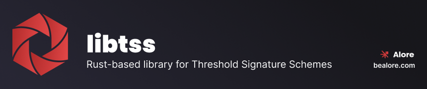

<div align="center">
    <picture>
        <source srcset=".assets/libtss-banner.png"  media="(prefers-color-scheme: dark)">
        
    </picture>

  <p>
    <a href="https://github.com/0xCarbon/libtss/actions?query=workflow%3Abuild-tsslib">
      
    </a>
    <a href="https://github.com/0xCarbon/libtss/pkgs/npm/rn-tss-module">
      
    </a>
  </p>
</div>

<br /> 

## Overview
Libtss is a Rust-based library that encapsulates various Threshold Signature Schemes (TSS), including our own [DKLs23](https://github.com/0xCarbon/DKLs23) implementation and others like Frost (in development). It provides an easy way to integrate with other programming languages via JSON serialization/deserialization and FFI (foreign function interface).The repository features client examples demonstrating integration with other languages, such as a C client and a React Native client. Additionally, it includes a sub-project, a React Native Turbo Module, published as an npm package, making it easy to integrate performant and memory-safe TSS methods, encapsulated in libtss, originally in Rust in React Native applications.

## Libtss SDK

You can use the Libtss runtime **embedded in different
languages** with the libtss SDK:

|                  | Language                             | Package                      | Documentation         |
| ---------------- | ------------------------------------ | ---------------------------- | --------------------- |
| ![Rust logo]     | [**Rust**][Rust integration]         | [`libtss` Rust crate] | [Learn][rust docs]    |
| ![C logo]        | [**C**][C integration]               | [`libtss.h` header] | [Learn][c docs]       |
| ![Go logo]       | [**Go**][go integration]             | _no published package_ | [Learn][go docs]      |
| ![react logo]    | [**React Native**][RN integration]   | [`libtss` NPM package]        | [Learn][rn docs]      |

[rust logo]: .assets/languages/rust.svg
[c logo]: .assets/languages/c.svg
[go logo]: .assets/languages/go.svg
[react logo]: .assets/languages/react.svg

[rust integration]: https://github.com/wasmerio/wasmer/tree/main/lib/api
[c integration]: SDK/c-client/main.c
[go integration]: https://github.com/wasmerio/wasmer-go
[RN integration]: SDK/rn-client

[`libtss` NPM package]: https://github.com/0xCarbon/libtss/pkgs/npm/rn-tss-module
[`libtss` Go package]: https://github.com/0xCarbon/libtss/pkgs/npm/rn-tss-module
[`libtss` Rust crate]: https://github.com/0xCarbon/libtss/pkgs/npm/rn-tss-module
[`libtss.h` header]: https://github.com/0xCarbon/libtss/pkgs/npm/rn-tss-module

[rust docs]: https://github.com/0xCarbon/libtss
[rn docs]: https://github.com/0xCarbon/libtss
[c docs]: https://docs.rs/wasmer-c-api/*/wasmer/wasm_c_api/index.html
[go docs]: SDK/c-client/

## Manual Setup for Cross-Compilation Environment

This guide provides step-by-step instructions to manually set up a cross-compilation environment on a Linux system. The environment includes Rust with various targets.

### Step 1: Install Required Packages
First, install the essential packages required for cross-compilation.
```
bash sudo apt-get update sudo apt-get install -y --no-install-recommends
curl
unzip
gcc
make
git
```


### Step 2: Install Rust and Add Targets
Install Rust using `rustup` and add the necessary targets for cross-compilation.
```
curl --proto '=https' --tlsv1.2 -sSf https://sh.rustup.rs | sh source $HOME/.cargo/env
```

### Step 2.1: Add the required Rust targets
```
rustup target add x86_64-unknown-linux-gnu
i686-unknown-linux-gnu
```


### Step 3: Set environment variables
```
source scripts/activate
```
This command will export the variable `$LIBTSS_PATH` and will append the scripts in `scripts/` directory to your `PATH`.

### Step 4: Build Your Project
Now that your environment is set up, you can start building your project using the scripts in the `scripts/` directory. You can build the libtss from any directory on your machine:
```
libtss-build
```

The `scripts` directory also provides a script to run tests:
```
libtss-test
```

## Building with a Docker (recommended)
```
git clone https://github.com/0xCarbon/libtss.git
cd libtss
docker-compose build
source scripts/activate
libtss-docker-build 
```
This will create a new directory `target/release` in the project's root with the compiled library (`libffi_tss.so`) for Linux x86_64.

## Contributing
We welcome contributions! Please see [CONTRIBUTING.md](CONTRIBUTING.md) for details on how to get started.

## Security
For information on how to report security vulnerabilities, please see our [SECURITY.md](SECURITY.md).

## Code of Conduct
Please note that this project is released with a [Contributor Code of Conduct](CODE_OF_CONDUCT.md). By participating in this project you agree to abide by its terms.


## License
This project is licensed under either of
- [Apache License, Version 2.0](LICENSE-APACHE)
- [MIT license](LICENSE-MIT)

at your option.

## Authors
See the list of [contributors](https://github.com/0xCarbon/libtss/contributors) who participated in this project.