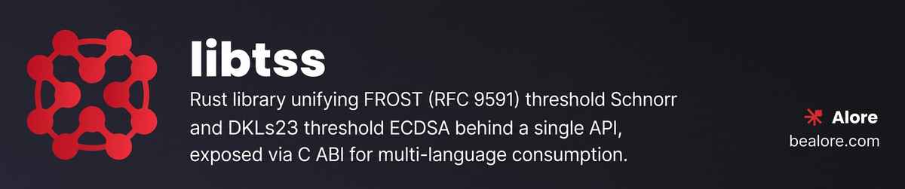

<div align="center">
    <picture>
        <source srcset=".assets/libtss-banner.png"  media="(prefers-color-scheme: dark)">
        
    </picture>

  <p>
    <a href="https://github.com/0xCarbon/libtss/actions?query=workflow%3ACI">
      
    </a>
  </p>
</div>

<br />

## Overview
libtss is a Rust library that unifies [FROST (RFC 9591)](https://www.rfc-editor.org/rfc/rfc9591.html) threshold Schnorr and [DKLs23](https://eprint.iacr.org/2023/765) threshold ECDSA behind a single API, exposed via C ABI for multi-language consumption.

### Key Features
- **Unified session API** &mdash; protocol-agnostic `new()` &rarr; `next()` loop for DKG, signing, and refresh
- **Protocol selection by ciphersuite** &mdash; FROST for Schnorr/BIP-340/Taproot; DKLs23 for ECDSA
- **C ABI + language bindings** &mdash; Go (cgo), React Native, WASM, .NET, Python
- **Transport-agnostic** &mdash; pure computation, bytes in/bytes out, no network or async runtime
- **Secret safety** &mdash; all key material in Rust memory with `zeroize`-on-drop; consumers get opaque handles

### Supported Protocols

| Protocol | Curves | Use Cases |
|----------|--------|-----------|
| FROST (RFC 9591) | secp256k1-TR, secp256k1, Ed25519, P-256, ristretto255, Ed448 | Bitcoin Taproot, Solana, TLS/WebAuthn |
| DKLs23 | secp256k1, secp256r1 | Ethereum, Bitcoin, Cosmos, TRON, NEO3, Sui |

## Getting Started

### Installation

1. **Install Rust using `rustup`**
```bash
curl --proto '=https' --tlsv1.2 -sSf https://sh.rustup.rs | sh
```

2. **Clone the repository:**
```bash
git clone https://github.com/0xCarbon/libtss
cd libtss
```

3. **Build:**
```bash
cargo build --workspace
```

4. **Run tests:**
```bash
cargo test --workspace
```

## Architecture

```
Applications (Go, Rust, React Native, WASM, .NET, Python)
    │
    ▼
Thin Language Bindings (libtss-go, libtss-rn, libtss-wasm, ...)
    │
    ▼
C ABI (libtss.h — stable header, generated by cbindgen)
    │
    ▼
libtss (Rust crate — unified API, handle registry, error mapping)
    │
    ├── frost-*  (ZCash Foundation FROST, 7 ciphersuites)
    └── dkls23-* (0xCarbon DKLs23, secp256k1 + secp256r1)
```

See [`spec/`](spec/) for the full design specification.

### Language Bindings

| Binding | Language | Description |
|---------|----------|-------------|
| [libtss-ffi](libtss-ffi/) | C ABI | FFI layer (cbindgen) |
| [libtss-go](libtss-go/) | Go | cgo binding |
| [libtss-wasm](libtss-wasm/) | JavaScript / TypeScript | WebAssembly (wasm-bindgen) |
| [libtss-rn](libtss-rn/) | React Native | iOS & Android |
| [libtss-python](libtss-python/) | Python | ctypes binding |
| [libtss-node](libtss-node/) | TypeScript (Node.js / Bun) | koffi FFI binding |
| [libtss-dotnet](libtss-dotnet/) | C# / .NET | P/Invoke binding |

## Contributing
We welcome contributions! Please see [CONTRIBUTING.md](CONTRIBUTING.md) for details on how to get started.

## Security
For information on how to report security vulnerabilities, please see our [SECURITY.md](SECURITY.md).

## Code of Conduct
Please note that this project is released with a [Contributor Code of Conduct](CODE_OF_CONDUCT.md). By participating in this project you agree to abide by its terms.

## License
This project is licensed under either of
- [Apache License, Version 2.0](LICENSE-APACHE)
- [MIT license](LICENSE-MIT)

at your option.

## Authors
See the list of [contributors](https://github.com/0xCarbon/libtss/contributors) who participated in this project.
